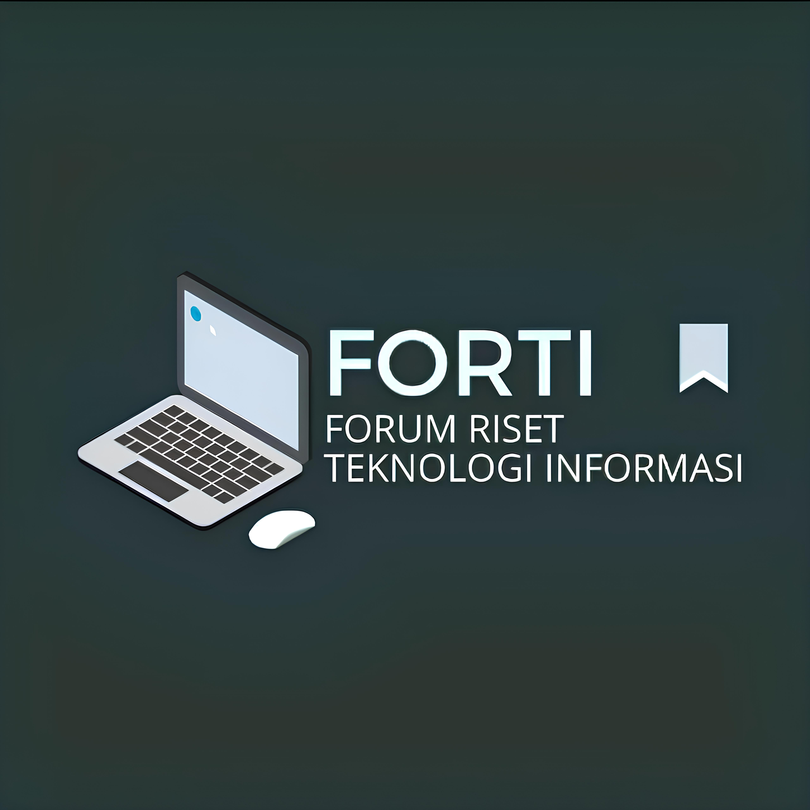

# FORTI - Forum Riset Teknologi Informasi

## Deskripsi Proyek

FORTI (Forum Riset Teknologi Informasi) adalah sebuah website untuk study club yang berfokus pada riset teknologi dan pemrograman di Politeknik Harapan Bersama, Kota Tegal. Proyek ini bertujuan untuk menyediakan platform informasi dan interaksi bagi anggota FORTI serta mempromosikan kegiatan dan pencapaian komunitas.

## Fitur Utama

- 🏠 Halaman Beranda dengan informasi umum tentang FORTI
- 👥 Profil Anggota dan Struktur Organisasi
- 📚 Informasi Program (Programming Class, Research Club, Competition Team, Workshop & Events)
- 🖼️ Galeri Kegiatan
- 📰 Blog dan Artikel Teknologi
- 📞 Halaman Kontak

## Teknologi yang Digunakan

- **Frontend**: 
  - Next.js 13 (React Framework)
  - Tailwind CSS untuk styling
- **UI Components**:
  - Lucide React untuk ikon
- **Deployment**:
  - Vercel (diasumsikan, karena menggunakan Next.js)

## Instalasi dan Penggunaan

1. Clone repositori ini: git clone https://github.com/your-username/forti-web.git 
   
2. Masuk ke direktori proyek: cd forti-web
   
3. Install dependensi: npm install
   
4. Jalankan server pengembangan: npm run dev
   
5. Buka [http://localhost:3000](http://localhost:3000) di browser Anda.

## Struktur Proyek
forti-web/
├── public/
│   └── images/
├── src/
│   ├── app/
│   │   ├── anggota/
│   │   ├── galeri/
│   │   ├── kontak/
│   │   ├── program/
│   │   └── tentang/
│   ├── components/
│   └── styles/
├── .next/
├── package.json
└── README.md

## Kontribusi

Kami sangat menghargai kontribusi dari komunitas. Jika Anda ingin berkontribusi pada proyek ini, silakan ikuti langkah-langkah berikut:

1. Fork repositori
2. Buat branch fitur baru (`git checkout -b feature/AmazingFeature`)
3. Commit perubahan Anda (`git commit -m 'Add some AmazingFeature'`)
4. Push ke branch (`git push origin feature/AmazingFeature`)
5. Buka Pull Request

## Lisensi

Distributed under the MIT License. See `LICENSE` for more information.

## Kontak

Riky Raharjo - [@rikyraharjo](https://www.instagram.com/_rraharjo/)

Project Link: [https://github.com/your-username/forti-web](https://github.com/your-username/forti-web)

---

Dibuat dengan oleh rikyraharjo

